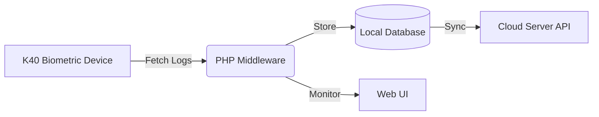

# K40 Middleware Using PHP

A lightweight and efficient PHP-based middleware designed to bridge the gap between K40 (and compatible) biometric attendance devices and cloud-based management systems. This tool automates the process of fetching attendance logs, storing them locally, and synchronizing them with a remote server.

## 🚀 Key Features

- **Device Integration**: Direct communication with biometric devices via network sockets.
- **Local Persistence**: Automatically saves attendance logs to a local database for offline reliability.
- **Cloud Synchronization**: Periodically pushes local records to a configurable cloud server API.
- **User Management**: Simple interface to synchronize user data from the device.
- **Data Portability**: Built-in export functionality to download attendance data in accessible formats.
- **Real-time Monitoring**: A web-based dashboard to visualize the synchronization process and device status.
- **Easy Configuration**: User-friendly settings page to update Device IP and Cloud Server URLs without touching code.

## 🛠️ System Architecture



1.  **Middleware**: Acts as the central hub, managing socket connections to the device.
2.  **Local Database**: Ensures no data is lost during network interruptions by caching logs locally.
3.  **Cloud API**: The final destination for attendance data, enabling remote reporting and management.

## 📋 Prerequisites

- **PHP 7.4 or higher**
- **PHP Sockets Extension**: Must be enabled in your `php.ini` (`extension=sockets`).
- **Web Server**: Apache or Nginx.
- **Database**: SQLite (default) or MySQL support.

## ⚙️ Installation & Setup

1.  **Clone the Repository**:
    ```bash
    git clone https://github.com/md-sada-mia/k40-middleware-using-php.git
    cd k40-middleware-using-php
    ```

2.  **Enable Sockets Extension**:
    Edit your `php.ini` file and ensure the following line is not commented out:
    ```ini
    extension=sockets
    ```

3.  **Permissions**:
    Ensure the web server has write permissions to the project directory (required for database initialization and log storage).

4.  **Launch**:
    Open the project in your browser (e.g., `http://localhost/k40-middleware-using-php`).

## 🔧 Configuration

Navigate to the **Configuration** page from the navigation menu to set up your environment:

-   **Device IP**: The local network IP address of your biometric device.
-   **Server Address**: The URL of your remote cloud API that will receive the attendance data.

## 📁 Project Structure

-   `index.php`: Main dashboard and automatic sync runner.
-   `configuration.php`: Device and server settings.
-   `user-sync.php`: Utility to sync user records from the device.
-   `export.php`: Interface for downloading attendance logs.
-   `controllers/`: Contains core logic, database managers, and third-party packages.
-   `ajax-*.php`: Backend endpoints for asynchronous sync operations.
-   `style.css` & `script.js`: Frontend styling and dynamic UI logic.

## 📄 License

This project is licensed under the MIT License - see the `LICENSE.txt` file for details.
